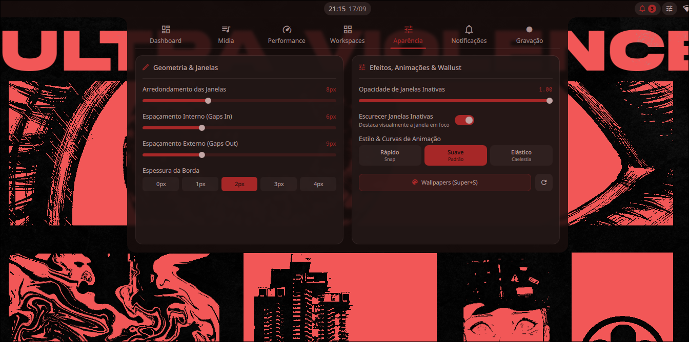
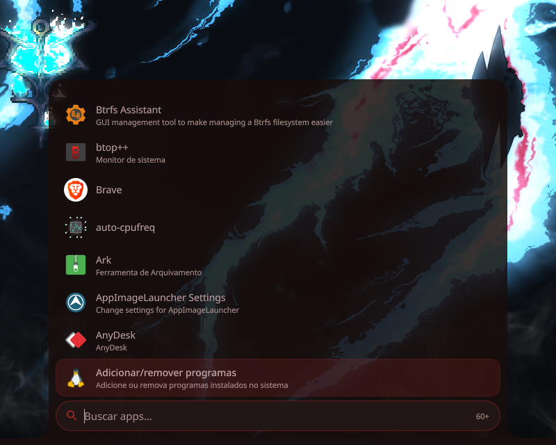
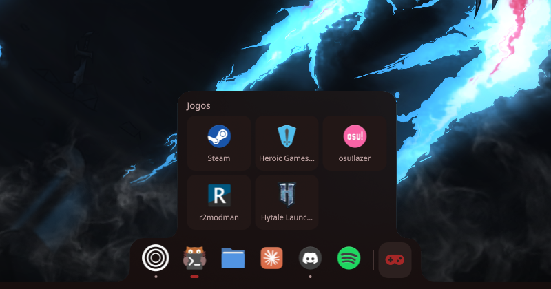
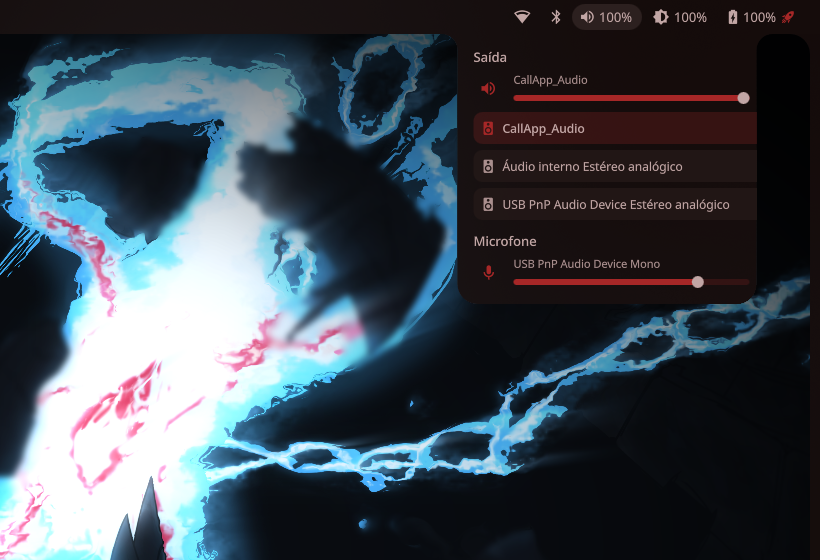
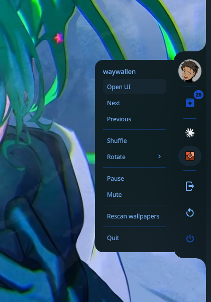

<div align="center">

# hollow-wired

**A responsive, hardware-accelerated Hyprland desktop environment powered by Quickshell, dynamic Material You theming, and hybrid GPU orchestration.**

[](https://archlinux.org)
[-00A3E0?style=for-the-badge&logo=hyprland&logoColor=white)](https://hyprland.org)
[-41CD52?style=for-the-badge&logo=qt&logoColor=white)](https://quickshell.outfoxxed.me)
[](https://github.com/InitCool/wallust)
[](LICENSE)

<br />



</div>

---

## Overview

**hollow-wired** is a modern Linux desktop environment built from the ground up for speed, visual coherence, and ergonomics. It combines the performance of **Hyprland** (configured exclusively with modern Lua) with the power of **Quickshell** for all desktop layer-shell interfaces.

Legacy tools like Waybar, Rofi, SwayOSD, and Wofi are completely omitted. Every shell element—top bar, docks, dynamic island OSD, app launcher, live task switcher, and interactive desktop widgets—is written as native QML components running directly on Wayland layer-shell protocols.

---

## Core Features

<div align="center">
<table>
<tr>
<td width="50%">

<p align="center"><b>App Launcher & Fuzzy Search</b></p>
</td>
<td width="50%">

<p align="center"><b>Smart Autohide Dock & Game Shelf</b></p>
</td>
</tr>
<tr>
<td width="50%">

<p align="center"><b>TopBar Flyout & Quick Controls</b></p>
</td>
<td width="50%">

<p align="center"><b>Slide-out Sidebar & System Trays</b></p>
</td>
</tr>
</table>
</div>

### Desktop Shell (Quickshell)
- **TopBar (`TopBar.qml`)**: 34px top bar with animated pill workspace indicators, active window titles, center clock with Hub trigger, and flyout menus with rounded inverted corners for Audio, Wi-Fi, Bluetooth, and Battery management.
- **Desktop Widgets (`DesktopWidgets.qml`)**: Layer-shell desktop widgets with 20px magnetic snap-to-grid positioning, visual inspector (glass, solid, glow, borderless styles; scalable 80% to 120%), and 13 native widgets:
  - Real RAM usage (excluding buffers/cache), CPU telemetry, GPU monitor (NVIDIA RTX / AMD / Intel), real-time Network speed monitor, Analog & Digital clocks, MPRIS music player with spinning vinyl animation, Monthly Calendar grid, Battery health, Storage usage, Pomodoro timer, persistent Notepad, Weather, and Daily quote.
  - Toggle edit mode at any time with `Super + W` or right-clicking empty desktop space.
- **Application Launcher (`Launcher.qml`)**: Keyboard-first fuzzy search opened via `Super` or `Super + R`. Features keyboard navigation, right-click contextual actions (pin to dock, add to gaming drawer), and instant query matching.
- **Autohiding Dock (`Dock.qml`)**: Edge-triggered bottom dock with active workspace indicators (`1·3` or `✦`), drag-and-drop reordering, expandable gaming shelf, and **dedicated Launcher button** with custom icon and animated GIF support (`rice-set-dock-icon`).
- **Shell Customization (`ShellCustomization.qml`)**: Unified visual styling engine for Hub, Sidebar, and Dock. Supports Glass, Solid, Glow (Neon), and Borderless styles, custom scales (80%, 100%, 120%), background opacities, and 6 accent colors with live reactive synchronization.
- **Dynamic Island OSD (`OSD.qml`)**: Non-intrusive floating capsule below the top bar providing visual feedback for volume levels, microphone mute, and screen brightness.
- **Energy Sidebar (`EnergySidebar.qml`)**: Slide-out right panel providing system tray icons, update count badges (Repo + AUR + Dotfiles), night light toggle, blur toggle, and two-step power options.
- **Workspace Overview (`Overview.qml`, `Super + Tab`)**: Workspaces laid out in a spring-animated 3D carousel with live window thumbnails at their real positions; click a window to jump to it, Enter to switch, number keys to jump.
- **Desktop Menu (`DesktopMenu.qml`)**: Right-click on an empty spot of the desktop for Settings, Display, Terminal, Wallpaper (greyed out without Waywallen), Edit widgets and more.
- **Newcomer helpers**: Usage tips delivered as notifications (`rice-tips`, each tip at most twice, toggle in the welcome screen and in Settings → Shortcuts), and a notification when an app opens a link in a browser sitting on another workspace (`rice-browser-notice`), with a button that takes you to the tab.
- **Alt+Tab Task Switcher (`AltTab.qml`)**: Live window thumbnails rendered via Wayland screencopy buffers, sorted by MRU (most recently used) focus history. Quick close windows on the fly with `Q`.
- **Native Clipboard (`Clipboard.qml`)**: Built-in clipboard manager invoked with `Super + V`, supporting quick search, image preview, and instant history clearing. Copied content survives closing the source application (`wl-clip-persist`), and a dedicated **Favourites** tab keeps pinned entries out of the rolling history.
- **Internationalization (i18n)**: Seamless bilingual localization (English & Brazilian Portuguese) across all shell components and settings via reactive JSON dictionaries and `Theme.t(...)`.
- **Media tab**: round album art ringed by a live audio spectrum, a draggable seek bar, shuffle and repeat (greyed out on players that do not support them), and a player picker so Spotify and a browser tab no longer fight over the controls.
- **Central Hub & Control Center (`VisualConfigPanel.qml` / `Super + I`)**: **19 configuration categories** grouped into Appearance, Hardware, System and Help, with a search box that finds individual settings rather than just categories. Highlights:
  - **Display**: every mode the monitor actually reports — resolution, all supported refresh rates, scale and rotation — with a 15-second automatic revert (the way Windows does it) so an unsupported mode can never leave you staring at a black screen.
  - **Notifications**: position, on-screen duration, corners and borders, plus a repair banner that appears when notification banners get stuck on screen or the service dies.
  - **Colors**: the full wallpaper palette, with **any colour replaceable by hand on an HSV colour wheel** and a toggle to lock the palette against wallpaper changes.
  - **Programs**: unified update count (official repos + AUR + Flatpak), a shortcut to whichever graphical package manager is installed, and the rice updater with the list of what is coming in the next update.
  - Keyboard (10 layouts, repeat rate, touchpad), idle/power timings, gaming & GPU, storage, printers, and a first-run **Welcome guide** aimed at people arriving from Windows.

- **Lock screen that can't strand you**: if the lock screen app ever dies while the session is locked — a crash, a GPU hiccup — Hyprland normally refuses to lock again and the only way out is a TTY or a hard reboot. Here `allow_session_lock_restore` is on and **Super + L works even while locked**, so pressing it brings the password prompt back.
- **Now-playing pill**: changing tracks briefly expands the OSD into album art (spinning while it plays), title and artist. Stays quiet over fullscreen windows and in Do Not Disturb.
- **Keep awake (`rice-caffeine`)**: the Windows "prevent sleep" equivalent, in the sidebar. Creates a real `systemd-inhibit` lock — which hypridle already honours — instead of suspending the idle daemon, so nothing stays stuck awake if the process dies. Closing the lid still suspends.
- **Scheduled night light (`rice-nightlight`)**: turns itself on at sunset and off at sunrise, or on a fixed schedule. Sunrise and sunset are computed **on the machine** from latitude and longitude, so it keeps working with no network. Settings survive reboots, and flipping it by hand holds the schedule off for a few hours instead of being undone a minute later.
- **Song lyrics (`rice-lyrics`)**: fetched from LRCLIB — open, no signup, no API key — and cached on disk, so a track is fetched once and the lyrics still show offline. Timed LRC files highlight and auto-centre the current line. When there is no exact match it falls back to a looser search that strips YouTube title noise ("(slowed)", "[Official Video]"…), and a track LRCLIB doesn't know is reported as "not found" instead of "no internet".
- **Media tab with two layouts**: *Disc* — a large vinyl that spins while music plays, scrolling title, output-device and player chips; or *Ring* — cover art wrapped in a live spectrum ring, controls in the middle and synced lyrics on the side. One button in the tab flips between them and the choice is remembered.
- **10-band equalizer (`rice-eq`)**: opened from the small music icon next to the top-bar clock, built on PipeWire's own `filter-chain` biquads — no EasyEffects, nothing extra to install. It runs as a transient user unit and registers as a WirePlumber *smart filter*, so it slots in front of whatever output is the default (speakers, Bluetooth headset, HDMI) and follows it when that changes, while the volume controls keep seeing the real device. Gains change live without cutting the audio; eight presets plus custom bands (drag, scroll, double-click to reset), with automatic pre-gain so boosts don't clip.
- **Animation curves (`rice-anim`)**: presets (Smooth, Bouncy, Snappy, Wind — the end-4/ML4W `wind/winIn/winOut` curves — and Material 3), or a Custom mode where each group (open, close, move, fade, workspaces, special workspace) gets its own draggable Bézier curve, duration and style, with a live preview using the same curve. The result is written to `~/.config/hypr/animations.lua`, which `hyprland.lua` loads, so the choice survives `hyprctl reload` — previously it was only applied with `hyprctl eval` and a reload silently reverted it.

### Theming & Dynamic Colors
- **Wallust Palette Engine**: Dynamic color palette extracted directly from the active wallpaper. Automatically updates Hyprland window borders, Quickshell UI surfaces, and Kitty terminal colors without requiring session restarts.
- **Hand-picked colour overrides (`rice-colors`)**: any palette entry can be replaced by hand from the Control Center colour wheel. Overrides live in a separate user file and are re-applied on top of every freshly extracted palette, so they survive wallpaper changes. `rice-colors auto 0` freezes the palette entirely.
- **Waywallen Integration**: Animated Wallpaper Engine scenes via Flatpak and a native layer-shell bridge. Wallpapers automatically pause when any application is in fullscreen to guarantee zero resource waste during games or video playback.
- **Wallpaper Switcher (`Super + S`)**: Interactive carousel selector to browse and apply installed wallpapers instantly.
- **Wallpaper transitions (`rice-wallpaper-fade`)**: switching an animated wallpaper kills one renderer and starts another, which costs anywhere from a few frames to almost a second. Instead of trying to blend two videos — which no backend supports — the screen is covered by a still of the incoming wallpaper while the outgoing one keeps animating underneath; the swap happens hidden behind it, and the layer only clears once the new renderer has **settled** — its CPU use is sampled until the texture/shader loading burst is over — and once the new palette (wallust) has been applied, so neither the loading stutter nor the shell recolouring happens in view. The login-screen background is regenerated afterwards at the lowest priority. Four styles, picked in the Colours tab: **fade**, **wipe** (30° diagonal), **wave** (a soft, rounded, blurred-edged front coming in from the right, slightly above centre) and **grow** (circle from the centre). The masks are GPU gradients, so the repo needs no shader build step.
- **Full-resolution stills (`rice-wallpaper-frame`)**: Wallpaper Engine ships a square thumbnail with each item — 140×140 to 1024×1024 — which looks terrible stretched to a screen and is a poor source for the palette. For video wallpapers a real frame is extracted with ffmpeg and cached, and it feeds both the transition and the colour generation.
- **Faithful palettes, never a light background**: the palette is built with `kmeans`, which clusters the image in Lab space and returns the colours the wallpaper actually has — white included. The previous `salience` tuning with `intensity = vibrant` manufactured colour instead: on a near-neutral wallpaper, forcing saturation to the maximum landed on red and turned the whole palette red. `rice-colors palette salience` restores the old, punchier behaviour. Independently of the algorithm, `rice-colors` darkens the background whenever it comes out too bright, preserving hue and saturation, and never touches the accents.
- **Lock Screen (`hyprlock`)**: frosted-glass card over the blurred desktop with a time-of-day greeting, large clock, localized date, rounded password field and a CPU / RAM / battery / weather row. Weather comes from a background-refreshed cache, because hyprlock runs every label synchronously and a slow command there stalls the whole screen. Its colours track the wallpaper through a dedicated wallust template.
- **Login Screen (SDDM + SilentSDDM)**: themed lock/login screen whose background is generated from the *actual wallpaper image* (adaptively darkened), never from a screenshot of your desktop. `rice-sddm-install` installs the theme, syncs your avatar and remembers the last session you logged into; `rice-sddm-preview` opens the whole thing in a test window so you can iterate without rebooting.

### Architecture & GPU Orchestration
- **Mesa iGPU Compositor**: Hyprland and Quickshell run on the integrated Intel GPU to eliminate inter-GPU copy overhead and maintain rock-solid frametimes at 144Hz.
- **On-Demand NVIDIA dGPU (`prime-run`)**: Heavy 3D applications and games invoke the dedicated NVIDIA RTX GPU on demand.
- **Hardware Screen Recording (`Recording.qml`)**: Integrated recording studio leveraging NVENC hardware acceleration (`h264_nvenc`) with independent system audio and microphone capture via PipeWire.
- **Safe Coexistence**: Completely isolated configuration paths. Runs cleanly alongside KDE Plasma or GNOME without conflicting with existing desktop environments.

---

## Keybindings

| Shortcut | Description |
|---|---|
| `Super` or `Super + R` | Toggle Application Launcher |
| `Super + Q` | Open Kitty Terminal |
| `Super + E` | Open Dolphin File Manager |
| `Super + I` | Open Control Center / Settings Hub (20 Categories) |
| `Super + F1` | Keybindings Cheatsheet |
| `Super + V` | Native Clipboard History |
| `Super + W` | Toggle Desktop Widgets Edit Mode |
| `Super + S` | Open Wallpaper Switcher |
| `Super + B` | Toggle Compositor Blur |
| `Super + Shift + B` | Toggle Ultra-Performance Mode (Blur & Animations OFF) |
| `Super + '` | Toggle Dropdown Terminal (*Dropterm*) |
| `Super + L` | Lock Screen (`hyprlock`) |
| `Super + M` | Exit Hyprland Session |
| `Alt + Tab` | Live Window Switcher |
| `Super + Tab` | Workspace Overview — 3D carousel of every workspace with live windows, plus a row of all open apps |
| `Super + Esc` or `Ctrl + Shift + Esc` | Task Manager (Mission Center, falls back to the Plasma/GNOME monitor or `btop`) |
| Right-click on the desktop | Quick menu: Settings, Display, Terminal, Wallpaper, Edit widgets, Files, Overview, Shortcuts |
| `Print` or `Super + Shift + S` | Region Screenshot — saves, copies to clipboard and notifies. Cancelling the selection captures the **entire screen** instead of doing nothing |
| `Super + Alt + S` | Interactive Screenshot with Annotation (Swappy) |
| `Super + Shift + R` | Record the entire display (press again to stop) |
| `Super + Shift + C` | Color Picker (`hyprpicker`) |
| `Super + Shift + X` | Force Kill Unresponsive Window (`hyprctl kill`) |
| `Super + Ctrl + R` | Emergency Reload Quickshell Shell |
| `Ctrl + Shift + M` | Toggle Discord / Vesktop Mute in background |
| `Num_Lock` or `Ctrl + Shift + D` | Toggle Discord / Vesktop Deafen in background |
| `Media Keys` | Volume, Brightness, Microphone Mute, Play/Pause |

---

## Installation

### Requirements
- **OS:** Arch Linux or CachyOS
- **GPU:** Intel / AMD / NVIDIA (Hybrid GPU fully supported)
- **Display Server:** Wayland

### One-Line Install (Curl)
Install directly with a single command in your terminal:

```bash
curl -sS https://raw.githubusercontent.com/Valcones47/hollow-wired/main/install.sh | bash
```

The repository is cloned to `~/.local/share/hollow-wired` (your settings live in `~/.config` as usual); `rice-update` pulls new versions from there. Older installs in `~/projetos/hollow-wired` are moved automatically when clean.

---

### Manual Setup
Or clone the repository and run the automated cyberpunk installer locally:

```bash
git clone https://github.com/Valcones47/hollow-wired.git
cd hollow-wired
chmod +x install.sh
./install.sh
```

The installer features an interactive **cyberpunk terminal UI** with animated **Serial Experiments Lain** ASCII transitions via `chafa`. It installs only the necessary ricing components (Hyprland, Quickshell, Wallust, audio, portals, and helpers), completely delegating GPU drivers and gaming packages to CachyOS/Arch Linux for maximum stability.

> **Note for KDE Plasma / GNOME Users:**  
> Testing `hollow-wired` will **not** modify or break your existing desktop configuration. When prompted to configure SDDM/Limine during installation, simply select **N** (default). Afterward, log out of your current session and choose **Hyprland** from your display manager's session menu.

---

## Dotfiles Updater

`hollow-wired` includes a built-in, non-destructive update system:

```bash
rice-update
```

- **Update Detection**: Background checks quietly query the upstream repository for new commits.
- **UI Notifications**: When updates are available, the update badge in the **Energy Sidebar** and **Control Center** highlights the new commit count.
- **Automated Backup**: Applying updates creates an automatic timestamped backup in `~/.config/rice-backup-<timestamp>`, pulls changes, syncs configurations, and hot-reloads Quickshell in place without interrupting open windows.
- **Safe against running binaries**: helpers are installed with `install(1)`, which unlinks before writing. A binary that happens to be running (the wallpaper bridge, the blur watcher) can no longer abort the update halfway and leave the machine half-new, half-old.
- **Resumes an interrupted update**: a marker records the last sync that actually *finished*. If the git tree moved but the marker did not, the next run redoes the sync instead of reporting "already up to date".

### Repair mode

```bash
rice-update fix
```

Also reachable from the update icon in the Energy Sidebar and from the Programs tab. It looks for — and fixes — the problems that have actually been reported by users:

| Check | Symptom it fixes |
|---|---|
| Notification config (`rice-mako-apply doctor`) | Banners that never leave the screen until clicked |
| Stopped background services | Clipboard no longer persists, notifications gone, blur toggle broken |
| Binaries left unwritten by a previous update | Helpers silently stuck on an old version |
| Corrupted JSON state files | Dock, widgets or preferences coming up empty |
| Missing execute bits / `~/.local/bin` off `$PATH` | `rice-*` commands "not found" |
| Missing `colors.conf` | Everything rendering grey |

---

## Repository Structure

```
hollow-wired/
├── dots/
│   ├── hypr/                 # Hyprland configuration (hyprland.lua, hyprlock, hypridle)
│   ├── quickshell/           # Native desktop shell (TopBar, Launcher, Dock, Hub, Widgets)
│   ├── kitty/                # Kitty terminal configuration
│   ├── wallust/              # Dynamic palette templates and color schemes
│   ├── xdg-desktop-portal/   # Wayland portal rules (KDE Breeze Dark file picker)
│   ├── fastfetch/            # System fetch configuration and custom ASCII/GIFs
│   ├── mako/                 # Notification daemon configuration
│   ├── sddm/                 # Login screen theme (SilentSDDM)
│   ├── applications/         # Desktop shortcut definitions (.desktop)
│   └── bin/                  # Helper CLI utilities (rice-update, rice-record, etc.)
├── packaging/                # Turnkey PKGBUILD & AUR installation recipes
├── quickshell-progress/      # Interface captures and preview media
├── install.sh                # Interactive automated installer
└── README.md                 # Project documentation
```

---

## License

Distributed under the [GPL-3.0 License](LICENSE).
